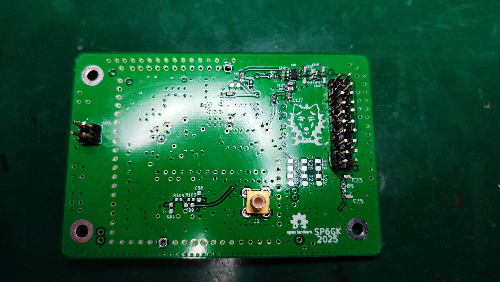
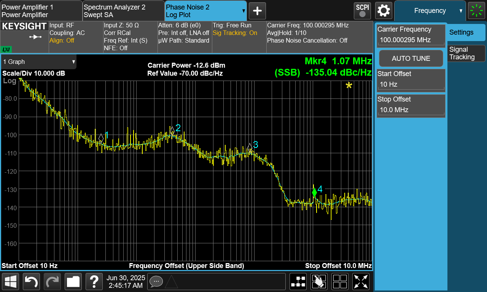
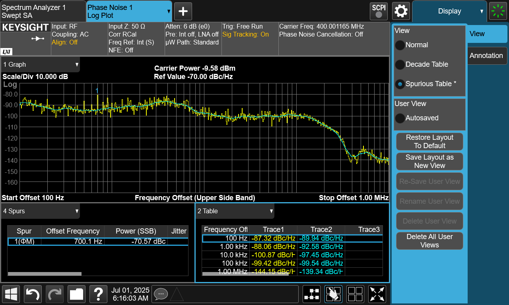
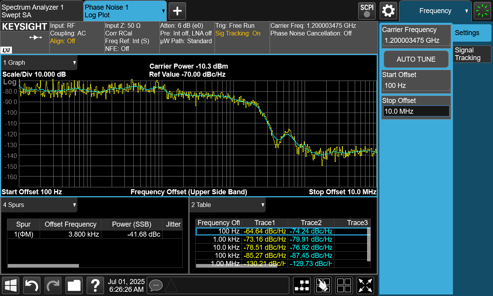
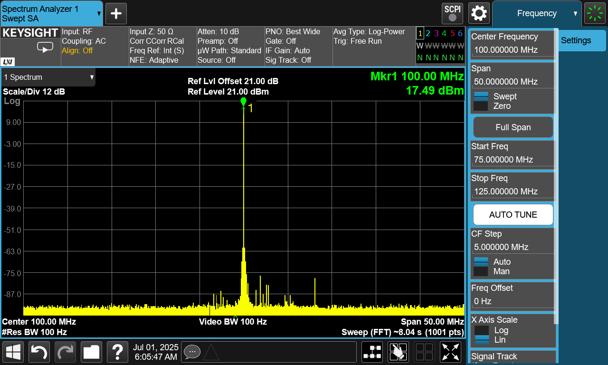
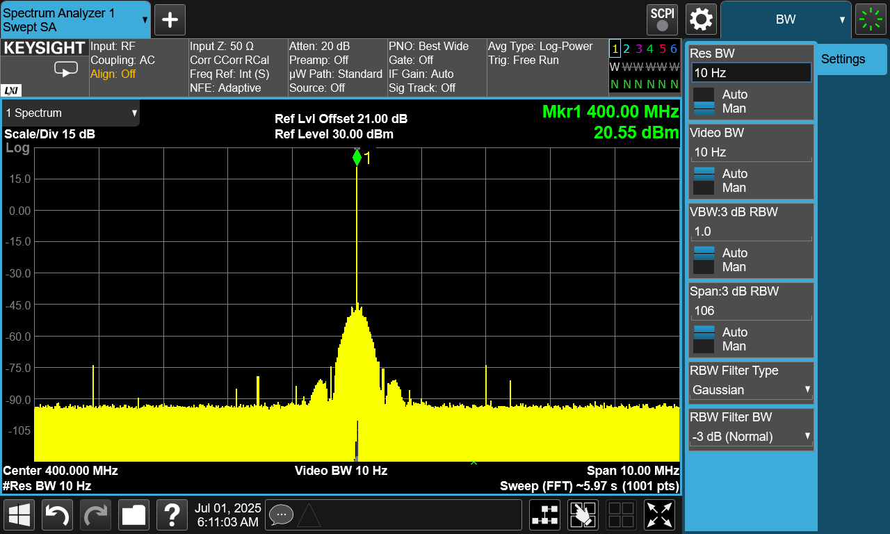

# High Quality RF Local Oscillator Module (ADF4351)

## Overview

This open-source PCB module is designed as a **drop in solution** for any project that requires a **high quality RF continuous wave signal** with at least **16 dBm output power**.  

I present more details on my website: [www.sp6gk.com](https://www.sp6gk.com/).

The design emphasizes:

- Output power (16–20 dBm depending on frequency)
- Low phase noise
- Minimal harmonics
- Easy integration into custom designs

Originally developed for the **Presto HF to QO-100 transverter project**, this module can be used in a wide variety of RF applications.

---

## Features & Specifications

| Parameter | Value |
|-----------|-------|
| **Optimal Frequency Range** | 400 MHz – 800 MHz (tunable for other ranges) or 1.5-2.1 GHz |
| **Output Power** | 20 dBm (50 Ω load) within optimal range |
| **Power Across Wide Range** | >17 dBm from 100 MHz to 2.4 GHz |
| **Phase Noise @ 400 MHz CW** | -89 dBc/Hz @ 100 Hz offset -97 dBc/Hz @ 10 kHz offset |
| **Reference** | onboard 48 MHz 0.5 ppm VCTCXO + 12-bit DAC digital tuning (or external reference) |
| **Filtering** | Two selectable low-pass filters |
| **PLL Chipset** | Fractional-N PLL (Analog Devices ADF4351) |
| **Dimensions** | 85 × 57 mm |
| **Supply Voltage** | 3.6 V recommended (5.5 V absolute maximum) for logic, 5.3 V for PA stage (5.5 V absolute maximum) |
| **Current Consumption** | < 250 mA (can be reduced by disabling output) |
| **Calibration Storage** | On-board EEPROM |
| **Interface** | SPI (programming PLL) + 3.3 V input pins for switching filters, PA enable etc... |

---

## Applications

- Test and Measurement Equipment
- VHF/UHF Communication Systems
- Amateur Radio
- Backhaul network

---

## Current revisions:
- 400 to 800 MHz rev 01a (tested and presented in the measurements)
- 400 to 800 MHz rev 01b (adds triplexer before amplifier to minimize reflections)
- 1.5-2.1 GHz rev 01a (tuned for higher frequency, includes triplexer and microstrip LPF)

## Performance Measurements

Testing was performed using a **Keysight CXA Spectrum Analyzer (N9000B)** with the **phase noise measurement** option.

**100 MHz**  

**400 MHz**  

**1.2 GHz**  

---

### Harmonics & Output Spectra

**100 MHz CW (50 MHz span)**  

**400 MHz CW (10 MHz span)**  

---
Module was tested with STM32F407 discovery board, using driver written by [KB3GTN](https://github.com/kb3gtn/STM32_ADF4351).

---
### What's next?

I intended to use this module for driving a passive RF mixer, however since then I have learned that those work better with square wave LO with lower amplitude.

Currently I am working on revision of this board with LMX2572LP.
I have found this IC to be easier to program while offering better performance especially in terms of spurious emissions.

---

## Repository Contents
- **/ECAD** (Kicad Project, simulations)
- **/Fabrication** (Gerbers)
- **/Verification** (Measurements)
- **/Documents** (BOM)
- **/Photos** (photos of assembled PCB)
